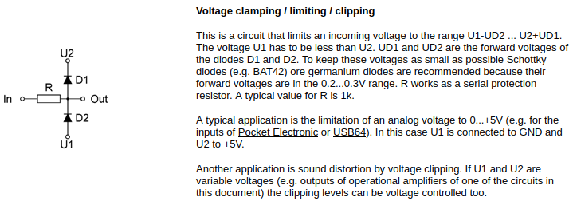
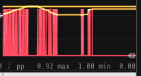

# The Euro-rack dump

Author Mark Russell and other peoples stuff from the internet
Apologies if not citations not properly done :)

# Table of Contents
- [The Euro-rack dump](#the-euro-rack-dump)
- [Table of Contents](#table-of-contents)
  - [Introduction](#introduction)
    - [Other peoples version so of this to observe](#other-peoples-version-so-of-this-to-observe)
  - [Potentiometers](#potentiometers)
  - [Opamps](#opamps)
    - [Opamp uses...](#opamp-uses)
    - [Common Opamp components](#common-opamp-components)
    - [Input protection: CV and Gate](#input-protection-cv-and-gate)
      - [How to scale CV if I want to scale the +/-10v range down to fit in 0-5v](#how-to-scale-cv-if-i-want-to-scale-the--10v-range-down-to-fit-in-0-5v)
      - [Gate protection - Clip everything above 5V and below 0V, and preserve that 0-5V range unchanged](#gate-protection---clip-everything-above-5v-and-below-0v-and-preserve-that-0-5v-range-unchanged)
      - [If you just need high/low gate/trigger input](#if-you-just-need-highlow-gatetrigger-input)
      - [Scale line level to modular level, 1Vac to 10Vac(and back again)](#scale-line-level-to-modular-level-1vac-to-10vacand-back-again)
      - [CV Attenuverters](#cv-attenuverters)
    - [Level shifting](#level-shifting)
    - [Euro power supply pins](#euro-power-supply-pins)
    - [Eurorack Panel dimensions](#eurorack-panel-dimensions)
  - [Open sound control](#open-sound-control)
    - [App's](#apps)
      - [Pure data patch](#pure-data-patch)
      - [Hexler's "TouchOSC"](#hexlers-touchosc)
        - [TouchOSC settings](#touchosc-settings)
        - [ipad settings](#ipad-settings)
        - [VCVrack Trowsoft cvOSCcv settings](#vcvrack-trowsoft-cvosccv-settings)
        - [OSC'elot settings](#oscelot-settings)
      - ["Open Stage control"](#open-stage-control)

## Introduction

A record of my doings

This is a bunch of Euro-rack circuits i have either found online or made-up myself

I will put pictures and links to [falstad simulations](https://www.falstad.com/circuit/), full schematics, maybe portions of data sheets, bits of code? How to setup VScode, scripting, anything all in one place is what i want.
I'm not sure how to organise this yet; by author, by purpose i.e. power, or CV, or...

### Other peoples version so of this to observe

## Potentiometers

Terminology: \
Center dented pots \
Other problems.

## Opamps

So many...

### Opamp uses...

So many...

### Common Opamp components

| name    | single supply | rail to rail       | good for    | cost |
| :-----: | :-----------: | :----------------: | :---------: | :--: |
| TL07x   | No            | No (Vpeak-1.5V) | most things | ?    |
| MCP600x | Yes           | Yes                | yeah stuff  | ?    |

### Input protection: CV and Gate

Check Mutable Instruments docs for good practises.

Input protection circuit for CV and gate. Protect your ADC's and digital pins. 
Perhaps your micro-controller has 3V3 logic, and any voltage above that will fry your electronics

#### How to scale CV if I want to scale the +/-10v range down to fit in 0-5v

From, [reddit link](https://www.reddit.com/r/synthdiy/comments/o74cer/input_protection_circuit_for_diy_eurorack_module/),

"Usually this can be done with just a single op-amp. I do it in a few ways:
If I want to scale the +/-10v range down to fit in 0-5v, I use a unity gain op-amp (TL072/TL074) to buffer the signal and then a couple voltage dividers to bring it to 0-5v like this: [falstad link](https://tinyurl.com/yk5b6qdb) or, -- see Picture

TODO: Verify How to scale +/-10V to 0-5V (ignore the "DC" comment at input) And why is it not 100kOhms input

#### Gate protection - Clip everything above 5V and below 0V, and preserve that 0-5V range unchanged

If I want to just clip everything above 5 and below 0 and preserve that 0-5 range unchanged, I just use an MCP6002 in a non-inverting buffer arrangement. MCP600x series work on a smaller voltage range (you can't bridge +/-12v with them) but if you can power them with 0v and 5v, they provide rail-to-rail output, which just means that they can output voltages right up to 5v (unlike a TL07x which would stop working when the input gets close to it's power supply). If you want to add a potentiometer value to the input, you can do that with the help of a voltage reference. (Or, just send the pot to a different pin and add them digitally). That looks like this: 

Also Doepfer doc have this 

#### If you just need high/low gate/trigger input

You can use a transistor instead of an op-amp. That could look like this (taken from different open source modules): https://tinyurl.com/yhqgrjg3

#### Scale line level to modular level, 1Vac to 10Vac(and back again)

My circuit to interface with a PC (AC coupled sound card, or not...) i.e. scale +/-1Vac to +/-10Vac.
Has 100k input impedance. 1K output impedance. Tl074 probably fine. – see Picture 3

Panel ideas.
Insert picture

#### CV Attenuverters

1. Use linear pots
2. A single op-amp is configured both as an inverting and non-inverting amplifier with unity gain.
3. Nice idea to use center dented pots to make life easier, because in the center position no signal
passes through

### Level shifting

TODO example circuits different ways +  some comments ...

12V to 5V \
5V  to 3V3 

3V3 to 5V \
5V  to 12V 

### Euro power supply pins

**Audio signals** are typically a maximum of 10 V peak-to-peak (i.e. between −5 V and +5 V).

**Control voltages** can either be unipolar or bipolar. Bipolar control voltages are typically 5 V peak-to-peak (i.e. from −2.5 V to +2.5 V), unipolar voltages between 0 V and 8 V. The V/Octave scale is used for pitch information.

**Trigger**, Gate or Clock signals are digital 0 V to 5 V pulses typically used for timing and event signalling.

### Eurorack Panel dimensions

**Height**: is measured in _U_, where \
U  = X cm = X inches             \
3U = 128.5mm/5.06" overall 

**Width:** is measured in _hp_, where \
1HP = 5.08mm/0.2"         \
84hp = X cm = X inches

**Depth:** is not specified but 

Shallow modules: (2.5 cm to 4 cm [1]) can fit into "skiff" cases and are casually referred to as "skiff friendly".

Extra deep: i.e. room to fit deep modules (2.00" (51mm) of available module depth).

**Screw size:** Standard M3 holes

## Open sound control

ToDo explanation
Pure data was useful to debug as it "just worked"

You can only have one thing ( vOSCcv/pureData etc ) listen at a time, you can't have pureData and cvOSCcv simultaneously listening

### App's

ToDo 3 apps see below

#### Pure data patch

#### Hexler's "TouchOSC"

TouchOSC is cheap ~£10 per device, on Linux i used the program to create the designs, as it seemed faster than using an ipad.

This worked well with VCV Racks module: "TrowSoft cvOSCcv".

##### TouchOSC settings

Schema to match that of _OSC'elot_ ... though hmmm this then means that cvOSCcv *has* to use a split for the polyphonic signal hmmm pff - good to know!

##### ipad settings
  
  connection type: "UPD"      \
  Host: 192.168.1.180 (ip of the target device i.e. linux machine)  \
  Send Port: 8000             \
  Receive Port: 7001          \
  ZeroConf: Disabled

address
arguments

##### VCVrack Trowsoft cvOSCcv settings

OSC ip Address : 192.168.1.75 (ip of the device, i.e. ipad) \
Out Port: 7001                \
InPort: 8000                  \
Namespace: not used so far

Message sent from ipad/TouchOSC, /name/fader is equivalent to /name/tag
the arguments are "ix" where i is the index and x the value of the fader

In the image below we can see, that

##### OSC'elot settings

I couldn't get to work, but it has **requirements**, See
[The github manual page](https://github.com/The-Modular-Mind/oscelot/blob/master/docs/Oscelot.md)

I decided to incorporate these requirements so that one schema fits all.

#### "Open Stage control"

Free open source and can be used on anything with a browser e.g. phone, raspi ...
TODO must try this out
